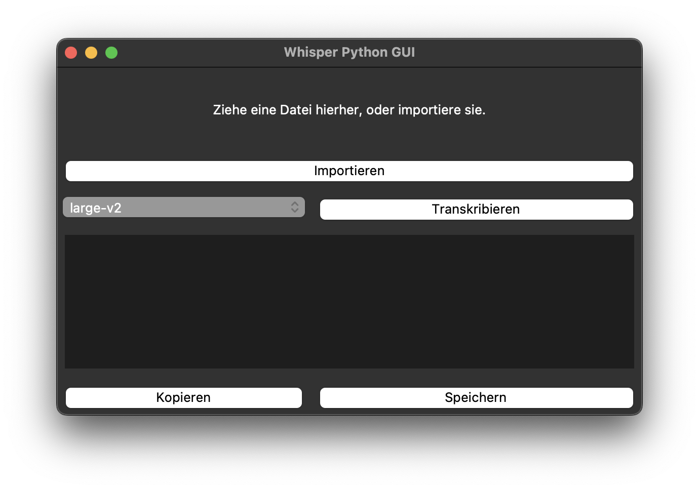

# GUI for OpenAI's Python implementation of Whisper

*the program icon was generated using DALL-E 3.

## Usage

- import a media file (video or audio)
- select a model (depending on your PC's specs)
- click on "Transkribieren" to start the process!

## Installation

- clone this repository
- install `brew install python3 ffmpeg mbedtls python-tk`
- on Windows, install `tkinter` and `ffmpeg` manually
